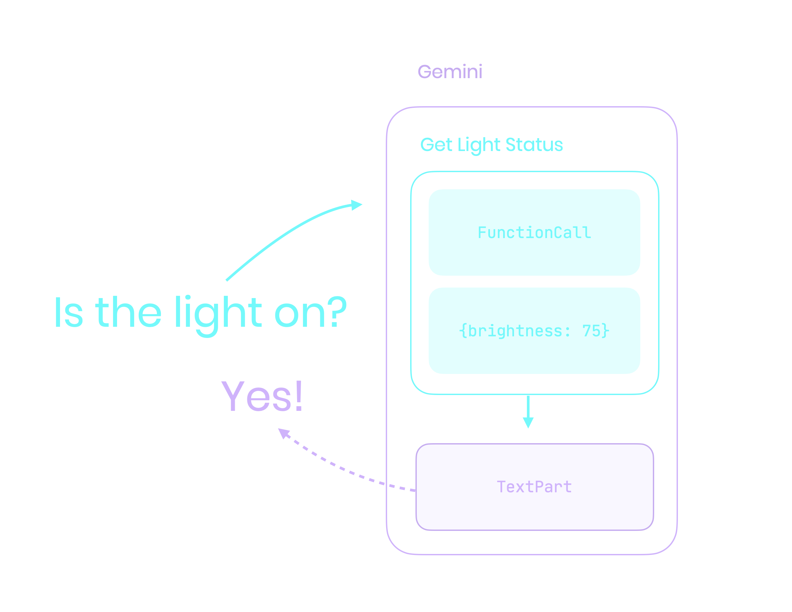
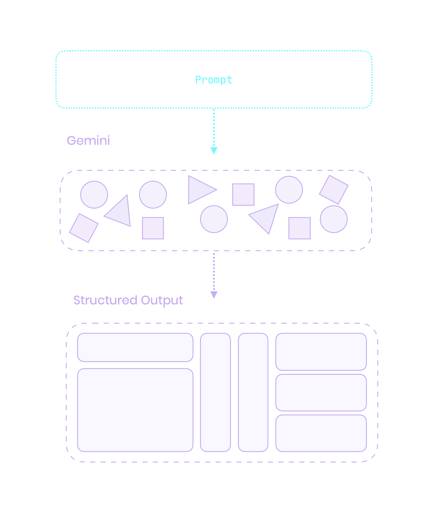
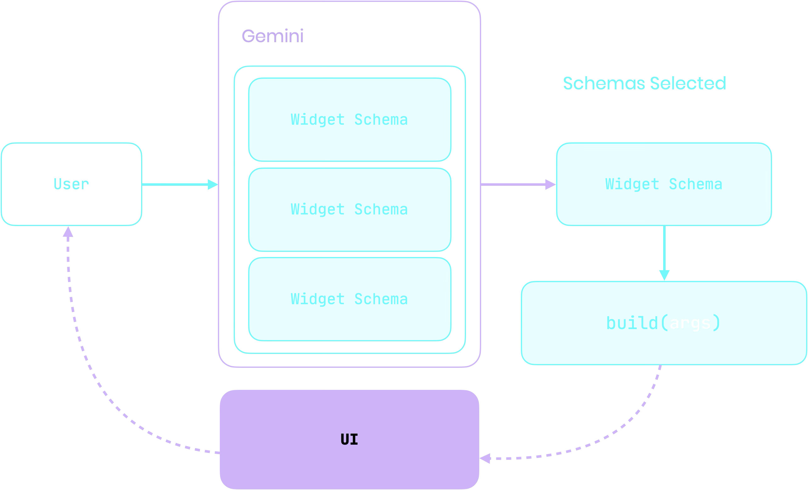
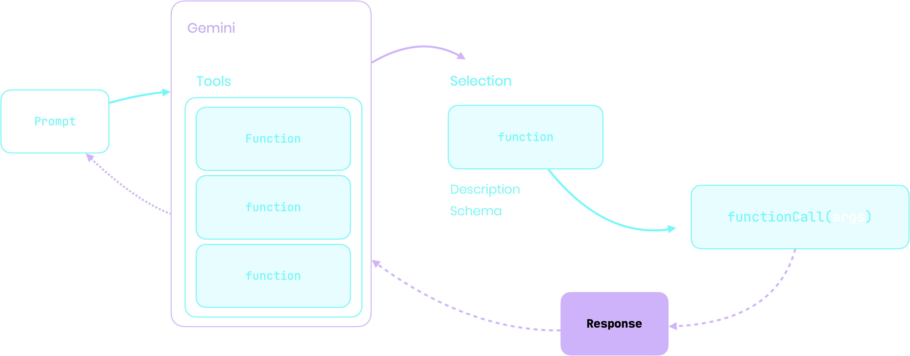
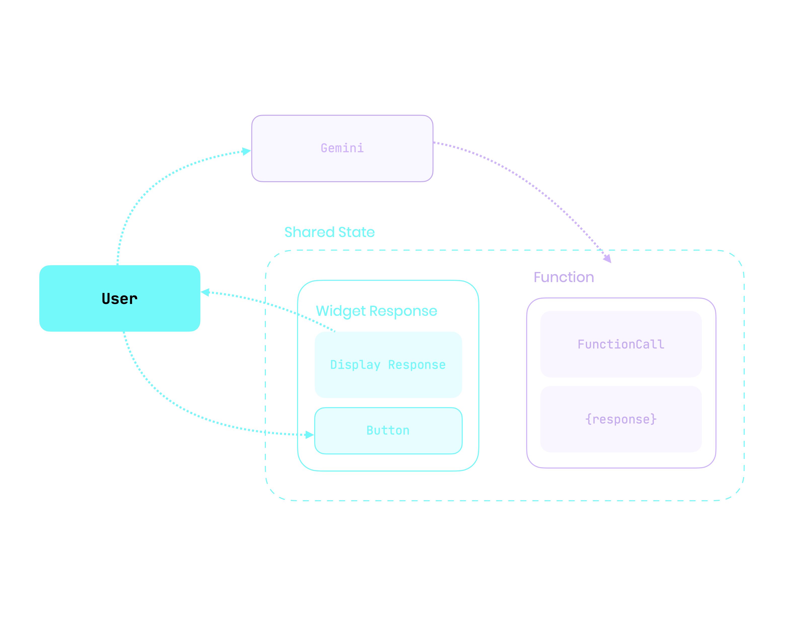

@section {
  flex: 2
}
@column {
  align: center
}
# Ephemeral UI {.heading}

---

@column {
  align: center
}

#### Leo Farias {.heading}
#### @leoafarias {.subheading}

@column {
  align: center_left
}
- Bitwild @ Concepta
- Open Source Contributor
- Flutter & Dart GDE
- Passionate about UI/UX/DX

---

@column

@column {
  align: center_left
  flex: 2
}
> [!WARNING]
> This presentation contains live AI-generated content. Unexpected things may occur during the demonstration.

@column

---

@column {
  align: center
}

## Every interface you use today was designed the same way {.heading}

@column {
  align: center_left
}

- Fixed. Static. One-size-fits-all.
- You adapt to it. It doesn't adapt to you.
- This has been true for 50 years.

---
@column
@column {
  align: center_left
  flex: 2
}

## The Shift {.heading}

- Your intent shapes what appears
- Compose around tasks, dissolve when done
- Define all capabilities, show only relevant ones

---

@column {
  align: center
  flex: 2
}

# The Everyone Tax {.heading}

@column {
  align: center_left
}

Every feature built for someone else is cognitive load you carry.

---

@section
@column {
  align: bottom_center
}
## The Toolbar Problem {.heading}

@section

@toolbar_demo {
  all: true
  align: top_center
  chat: false
}

---

@column {
  align: center
}

## Not so simple {.heading}

@column {
  align: center_left
  flex: 2
}


- Show everything. Everyone drowns.
- Hide everything. Everyone hits walls.
- One size fits all. Nobody gets what they need.

---
style: quote
---

@column {
  flex: 3
}

> "Intent-based outcome specification...the first new UI interaction paradigm since the invention of GUIs"
>
> — IBM Research AI

@column

---

@column {
  align: center
}

## What Changed? {.heading}

@column

- LLMs can now understand intent.
- LLMs can respond in a structured format.
- LLMs can now adapt based on context.

---

@column {
  align: center
}

## Understanding Intent {.heading}
#### LLMs translate natural language into function calls. {.subheading}

@column




---

@column {
  align: center
}

## Structured Output {.heading}
#### LLMs transform unstructured intent into structured UI. {.subheading}

@column {
  align: center
  flex: 1
}




---

@column {
  align: center
}
## Generative + Ephemeral UI {.heading}
The new paradigm is now possible.

@column

- **Generative UI:** AI composes interface from intent
- **Ephemeral UI:** Interface exists only while relevant
- **Together:** Interfaces materialize when needed, adapt to context, dissolve when done.

---

@column {
  align: center
}
## Define Capabilities {.heading}

You're not defining screens.
You're defining what the system can do.

@column

```dart
final schema = Schema.object(properties: {
  'label': Schema.string(
    description: 'The label of the dropdown',
  ),
  'currentValue': Schema.string(
    description: 'The current value',
  ),
  'options': Schema.array(
    description: 'Available options',
    items: Schema.string(),
  ),
});
```

---

@column {
  align: center
}

### Schema → UI Flow {.heading}
Define schemas. AI selects. Flutter builds.

@column {
  align: center
  flex: 2
}




---

@column {
  align: center
}
## Intent → Interface {.heading}

@column {
  align: center
  flex: 2
}



---

@column
## Ephemeral Lifecycle {.heading}

Appears when needed.
Dissolves when done.

@column

```dart
// ❌ Timer: "Disappear after 5 seconds"
if (minutesSinceInteraction > 5) vanish();

// ✅ Purpose: "Disappear when irrelevant"
if (taskCompleted) dissolve();
if (!isRelevantAnymore(context)) fade();
if (userNavigatedAway) dissolve();
```

---

@column {
  align: center
}

## Context-Driven Adaptation {.heading}

@column {
  align: center_left
  flex: 2
}

Same capability, different contexts = different interfaces.

- **Who:** User preferences and history
- **What:** Current task and intent
- **When:** Time of day, urgency
- **Where:** Location, device

Context fusion: Multiple signals → Single understanding.

---


@smart_oven {
  chat: true
}

---
style: fullscreen
---

@column {
  align: center
}
## Agentic Interfaces {.heading}

@travel_app

---


@column {
  align: center
}

### Conversation Loop {.heading}
Shared state evolves through conversation.

@column {
  align: center
  flex: 2
}




---
style: quote
---

> "Simple is hard. Easy is harder. Invisible is hardest."
> — Jean-Louis Gassée

---

## What Changes {.heading}


- Action → Intent-centric
- Navigation → Composition
- Persistent UI → Ephemeral UI
- Static → Generative & Adaptive
- Manual learning → Automatic understanding


---

@column {
  align: center
}
## Flutter + AI {.heading}
https://github.com/flutter/genui

@column

- Schema-based capability definition
- Context-aware composition
- LLM-driven intent understanding
- Flutter's declarative architecture


---

@column {
  align: center
}

## Thank You? {.heading}
