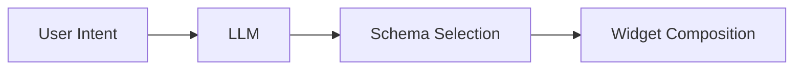

---

@smart_oven {
  chat: true
}

---
style: fullscreen
---

@toolbar_demo {
  all: true
}

---

@section {
  flex: 2
}
@column {
  align: center
}
# Fleeting {.heading}
# Interface {.subheading}

---

@column {
  align: center
}

#### Leo Farias {.heading}
#### @leoafarias {.subheading}

@column {
  align: center_left
}
- Bitwild @ Concepta
- Open Source Contributor 
- Flutter & Dart GDE
- Passionate about UI/UX/DX

---

@column

@column {
  align: center_left
  flex: 2
}
> [!WARNING]
> This presentation contains live AI-generated content. Unexpected things may occur during the demonstration.

@column

---

@column {
  align: bottom_left
}

### I built something that felt like mine {.heading}

---

## Then everyone wanted something {.heading}

---

@column {
  align: center_left
}

## Stop designing **screens**. {.heading}
## Start composing **moments**. {.subheading}

---

## Stop building **navigation**. {.heading}
## Start fulfilling **intent**. {.subheading}

---

## Stop making users **select**. {.heading}
## Start making interfaces **think**. {.subheading}

---

@column {
  align: center_right
}

## The Everyone Tax {.heading}

---


## Traditional 'one-size-fits-all' interfaces impose 'Everyone Tax' through cluttered features and options {.heading}

---

@column
@column {
  flex: 3
  align: center
}
## The Paradigm Shift {.heading}
AI Makes Intent-Driven Interfaces Possible
@column

---

@column {
  align: center
}
## Generative UI + Ephemeral UI {.heading}
Two concepts that change everything

---


### Intent-based outcome specification... the first new UI interaction paradigm since the invention of GUIs"
#### IBM Research AI (2024)

---

@column {
  align: center
}
## Demo: The Toolbar Problem {.heading}

@editorDemo {
  name: editorDemo
}

---


## The best UI designs do more than work—they think for the user

---

@column {
  align: center
}
## How Generative UI Works {.heading}
AI Understands Capabilities Through Schemas

@column {
  flex: 3
}


---

@column {
  flex: 2
  align: center
}
## Define Capabilities with Schemas {.heading}

@column

```dart
final schema = Schema.object(properties: {
  'label': Schema.string(
    description: 'The label of the dropdown',
  ),
  'currentValue': Schema.string(
    description: 'The current value',
  ),
  'options': Schema.array(
    description: 'Available options',
    items: Schema.string(),
  ),
});
```

---

@column {
  align: center
}
## Intent → Interface Flow {.heading}

@section



---

@column {
  align: center
}
## LLMs Orchestrate Capabilities {.heading}

@column {
  flex: 3
}


---

@column {
  flex: 2
  align: center
}
## Schema → Widget Mapping {.heading}

@column {
  flex: 3
}


---

@column {
  flex: 2
  align: center
}
## Behaviors as Building Blocks {.heading}

@column

```dart
abstract class Behavior {
  Widget manifest(Intent intent);
  bool isRelevant(Context context);
}
```

---

## From States to Behaviors {.heading}

```dart
// Old: State-driven
setState(() => showFeature = true);

// New: Behavior-driven
behaviors.where((b) => b.isRelevant(context))
```


---

@column {
  flex: 2
  align: center
}
## Ephemeral UI {.heading}
**Purpose-driven lifecycle, not timer-based**

Appears When Needed, Dissolves When Done

@column

```dart
// ❌ WRONG: Timer-based
if (minutesSinceInteraction > 5) vanish();

// ✅ RIGHT: Purpose-driven
if (taskCompleted) dissolve();
if (!isRelevantAnymore(context)) fade();
```

---

## Purpose-Driven Lifecycle {.heading}
Not Timer-Based

**Temporary manifestation of permanent capabilities**

- Interface exists while serving a purpose
- Not for a duration, but for an intent
- Capabilities persist, manifestation changes

---


> *"Design isn't crafting a beautiful button. It's figuring out if there's a way to get rid of the button altogether."*
> — Edward Tufte

---

@column {
  align: center
}
## Context-Aware Oven Demo {.heading}
Same Interface, Different Context 

@smartOven {
  
}

---

@readingDemo{

}
---

@section
@column {
  align: center_left
}
## Flutter Generative UI Chat {.heading}
Intent-driven conversation that renders Generative UI surfaces live.

@section {
  flex: 2
}
@flutter_gen_ui_chat {

}
---

@column {
  align: center
}
## Natural Language Interaction {.heading}

@column {
  flex: 3
}


---

## Conversation as State {.heading}

```dart
User: "Show ocean temperatures"
→ Temperature map appears

User: "How does this connect to storms?"
→ Map adds storm overlay

User: "Focus on 2020"
→ Map zooms to 2020 data
```

**No navigation. Just conversation refinement.**

---

## State Emerges from Dialogue {.heading}

**Traditional:** Navigate through predefined states
- Menu → Submenu → Feature → Settings

**Intent-Driven:** Evolve through conversation
- "I want..." → Interface adapts
- "Also show..." → Interface expands
- "Focus on..." → Interface refines

---


> "Ephemeral UIs—UI elements dynamically generated by LLMs"
> — Apple Inc. Research Team (2024)

---

@column {
  flex: 2
  align: center
}
## Generative UI in Practice {.heading}
Simple Code, Intelligent Results

@column

```dart
@override
Widget build(context) {
  return EphemeralUI(
    intent: userIntent,
    schema: behaviorSchema,
  );
}
```

---

@column {
  align: center
}
## Widget Response {.heading}

@column {
  flex: 3
}


---


> "Simple is hard. Easy is harder. Invisible is hardest."
> — Jean-Louis Gassée


---

@column {
  flex: 2
  align: center_right
}
## The Shift {.heading}


@column {
  flex: 2
  align: center_left
}
## Intent-Driven, Not Application-Driven {.subheading}


---

@column
@column {
  flex: 3
  align: center
}
## Generative UI: Intent Shapes Interface {.heading}
Schema Defines Capabilities, Context Determines What Appears
@column


---

> "The future of UI might be orchestrating user experiences rather than creating it."

---

## What Changes {.heading}

**From → To**

- Application-centric → Intent-centric
- Navigation → Composition
- Persistent UI → Ephemeral UI (understanding persists)
- Static → Generative & Adaptive

---

## What Stays {.heading}

**Users Remain in Control**

- User agency and choice
- Transparency in how system works
- Ability to override and customize
- Your data, your rules

**This isn't taking control away—it's giving control back**

---

@column {
  flex: 2
  align: center_right
}
## Flutter + AI {.heading}

@column

@column {
  flex: 2
  align: center_left
}
## Natural Fit for Intent-Driven Interfaces {.subheading}


---

## Getting Started {.heading}

**What's Real Today**

- Schema-based tool selection ✓
- Context-aware composition ✓
- LLM-driven intent understanding ✓
- Flutter's declarative widgets ✓

**This isn't future tech—it's available now**

---

## Start Small, Ship Fast {.heading}

**First Step:**

1. One screen
2. One context signal (time, location, or user state)
3. Two interface states
4. Ship it.

**Then iterate based on real user behavior**

---

@column {
  flex: 2
  align: center
}
## Intent-Driven Interfaces Aren't Coming {.heading}

@column

**They're here. Ready to build?**

---

@column {
  align: center
}

## Questions? {.heading}
