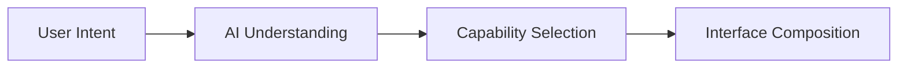

@section {
  flex: 2
}
@column {
  align: center
}
# Fleeting {.heading}
# Interface {.subheading}

---

@column {
  align: center
}

#### Leo Farias {.heading}
#### @leoafarias {.subheading}

@column {
  align: center_left
}
- Bitwild @ Concepta
- Open Source Contributor
- Flutter & Dart GDE
- Passionate about UI/UX/DX

---

@column

@column {
  align: center_left
  flex: 2
}
> [!WARNING]
> This presentation contains live AI-generated content. Unexpected things may occur during the demonstration.

@column

---

@column {
  align: center
}

## Every interface you use today was designed the same way {.heading}

@column {
  align: center_left
}

- Fixed. Static. One-size-fits-all.
- You adapt to it. It doesn't adapt to you.
- This has been true for 60 years.

---
@column
@column {
  align: center_left
  flex: 2
}

## The Shift {.heading}

- Your intent shapes what appears
- Compose around tasks, dissolve when done
- Define all capabilities, show only relevant ones

---

@column {
  align: center
  flex: 2
}

# The Everyone Tax {.heading}

@column {
  align: center_left
}

Every feature built for someone else is cognitive load you carry.

<!-- talk about different types of cognitive load -->

---

@section
@column {
  align: bottom_center
}
## The Toolbar Problem {.heading}

@section

@toolbar_demo {
  all: true
  align: top_center
  chat: false
}

---

@column {
  align: center
}

## Not so simple {.heading}

@column {
  align: center_left
  flex: 2
}


- Show everything. Everyone drowns.
- Hide everything. Everyone hits walls.
- One size fits all. Nobody gets what they need.

---
style: quote
---

@column {
  flex: 3
}

> "Intent-based outcome specification...the first new UI interaction paradigm since the invention of GUIs"
>
> — IBM Research AI

@column

---

@column {
  align: center
}

## What Changed? {.heading}

@column

- LLMs can now understand intent.
- LLMs can respond in a structured format.
- LLMs can now adapt based on context.


---

@column {
  align: center
}
## Generative + Ephemeral UI {.heading}
The new paradign is now possible.

@column

- **Generative UI:** AI composes interface from intent
- **Ephemeral UI:** Interface exists only while relevant
- **Together:** Interfaces materialize when needed, adapt to context, dissolve when done.

---

@column {
  align: center
}
## Define Capabilities {.heading}

You're not defining screens.
You're defining what the system can do.

@column

```dart
final schema = Schema.object(properties: {
  'label': Schema.string(
    description: 'The label of the dropdown',
  ),
  'currentValue': Schema.string(
    description: 'The current value',
  ),
  'options': Schema.array(
    description: 'Available options',
    items: Schema.string(),
  ),
});
```

---

@column {
  align: center
}
## Intent → Interface {.heading}

@section



@column {
  align: center_left
  flex: 2
}

User expresses intent.
AI understands context.
AI selects relevant capabilities.
Interface appears.

Sub-300ms.

---

@column
## Ephemeral Lifecycle {.heading}

Appears when needed.
Dissolves when done.

@column

```dart
// ❌ Timer: "Disappear after 5 seconds"
if (minutesSinceInteraction > 5) vanish();

// ✅ Purpose: "Disappear when irrelevant"
if (taskCompleted) dissolve();
if (!isRelevantAnymore(context)) fade();
if (userNavigatedAway) dissolve();
```

---

@smart_oven {
  chat: true
}


---

@section
@column {
  align: center_left
}
## Agentic Travel Planner {.heading}
All Gen UI surfaces are rendered live from Firebase AI.

@section {
  flex: 2
}
@travel_app {

}

---

## Conversation as State {.heading}

User: "Show ocean temperatures"
→ Temperature map appears

User: "How does this connect to storms?"
→ Map adds storm overlay

User: "Focus on 2020"
→ Map zooms to 2020 data

**Traditional:** Navigate predefined paths
Menu → Submenu → Feature → Settings

**Intent-Driven:** Evolve through conversation
"I want..." → Interface adapts
"Also show..." → Interface expands
"Focus on..." → Interface refines

No predetermined flow. Just conversation refinement.


---
style: quote
---

> "Simple is hard. Easy is harder. Invisible is hardest."
> — Jean-Louis Gassée

---

## What Changes {.heading}

**From → To**

Application-centric → Intent-centric
Navigation → Composition
Persistent UI → Ephemeral UI
Static → Generative & Adaptive
Manual learning → Automatic understanding

---

## What Stays {.heading}

**Users Remain in Control**

- User agency and choice
- Transparency in how system works
- Ability to override and customize
- Your data, your rules

**This isn't taking control away—it's giving control back**

---

@column {
  align: center
}
## Flutter + AI {.heading}

@column {
  align: center_left
  flex: 2
}

**What's real today:**

Schema-based capability definition
Context-aware composition
LLM-driven intent understanding
Flutter's declarative architecture

This isn't future tech. It's available now.


---

@column {
  align: center
}

## Thank You? {.heading}
