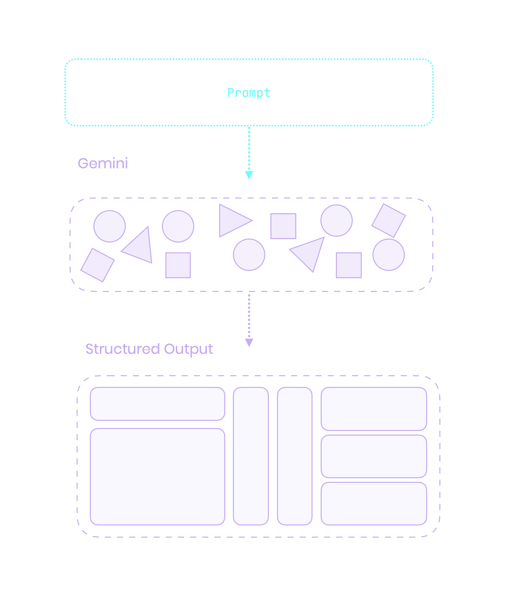

---

{@section flex: 2}
{@column
  align: center
}
# Generative UI {.heading}
# with Flutter {.subheading}

---

{@column 
  align: center
}

#### Leo Farias {.heading}
@leoafarias {.subheading}

{@column align: center_left}
- Founder/CEO/CTO
- Open Source Contributor (fvm, mix, superdeck, others..)
- Flutter & Dart GDE
- Passionate about UI/UX/DX


---

{@column}

{@column 
  align: center_left 
  flex: 2
}
> [!WARNING]  
> Esta presentación contiene contenido generado en vivo por IA. Durante la demostración pueden ocurrir eventos inesperados

{@column}

---

{@column 
  flex: 2 
  align: center_right
}
### Generative UI {.heading}
{@column}
## VS 
{@column flex: 2}
### AI Assisted Code Generation

---

### ¿Qué es una UI Generativa? {.heading}

{@column}

- Los LLM son excelentes para generar contenido basado en el contexto.
- Las GUI son excelentes para proporcionar interfaces estructuradas e interactivas para la entrada de usuario y navegación.


---

# LLM ❤️ GUI {.heading}

---
{@column}
{@column
  flex: 5
  align: center
}
### Crea interfaces dinámicas y sensibles al contexto al interpretar acciones y mantener el estado con LLMs para respuestas fluidas e interactivas. {.heading}

{@column}

---

### Ventajas sobre el chat

-	Más intuitivo y fácil de usar, especialmente para tareas complejas
-	Ciclo de feedback más rápido entre usuarios y LLMs
-	Mejora la eficiencia y la interacción

---

{@column}

{@column
  flex: 3 
  align: center
}
### Flutter es ideal para UI Generativa
Built for any screen: Ideal para generar UIs adaptativas en diversos dispositivos y plataformas.

{@column}

---

### ¿Cómo pueden los LLM comprender tu UI?

{@column}




---
{@column}

### Definir el schema{.heading}

{@column}

```dart
final schema = Schema.array(
  description: 'List of recipes',
  items: Schema.object(
    properties: {
      'recipeName': Schema.string(
        description: 'Name of the recipe.',
        nullable: false,
      ),
    },
    requiredProperties: ['recipeName'],
  ),
);

```{.code}

---

{@column align: bottom_center}

### Configurar responseMimeType y responseSchema {.heading}

{@column}

```dart
final schema = Schema.array(
  description: 'List of recipes',
  items: Schema.object(
    properties: {
      'recipeName': Schema.string(
        description: 'Name of the recipe.',
        nullable: false,
      ),
    },
    requiredProperties: ['recipeName'],
  ),
);


final model = GenerativeModel(
  model: 'gemini-1.5-pro',
  apiKey: apiKey,
  generationConfig: GenerationConfig(
    responseMimeType: 'application/json',
    responseSchema: schema,
  ),
);

```{.code}

---

{@section flex: 2}


{@column flex: 2}

#### Pasar un prompt a tu modelo {.heading}

{@column flex: 3}

```dart
final prompt = 'List a few popular cookie recipes.';
final response = await model.generateContent([Content.text(prompt)]);

print(response.candidates.first.content);

```{.code}

{@section flex: 3}

{@column 
  flex: 2
  align: bottom_left
}

#### JSON Response

{@column flex: 3}

```json
[
  {
    "recipeName": "Chocolate Chip Cookies"
  },
  {
    "recipeName": "Peanut Butter Cookies"
  },
  {
    "recipeName": "Snickerdoodles"
  }
]
```


---

{@column}
### Generador de paleta de colores

Genera una paleta de colores basada en un texto dado.

- Name of the palette
- Font family
- Font color
- Color for each corner of the palette

--- 


```dart
final schema = Schema.object(properties: {
  'name': Schema.string(
    description:
        'The text content to display on color palette. Format: #FF0000',
    nullable: false,
  ),
  'font': Schema.enumString(
    enumValues: ColorPaletteFontFamily.enumString,
    description: 'The font to use for the poster text.',
    nullable: false,
  ),
  'fontColor': Schema.string(
    description: 'The hex color value of the poster text. Format: #FF0000',
    nullable: false,
  ),
  'topLeftColor': Schema.string(
    description:
        'The hex color value top left corner of color palette. Format: #FF0000',
    nullable: false,
  ),
  'topRightColor': Schema.string(
    description:
        'The hex color value top right corner of color palette. Format: #FF0000',
    nullable: false,
  ),
  'bottomLeftColor': Schema.string(
    description:
        'The hex color value bottom left corner of color palette. Format: #FF0000',
    nullable: false,
  ),
  'bottomRightColor': Schema.string(
    description:
        'The hex color value bottom right corner of color palette. Format: #FF0000',
    nullable: false,
  )
}, requiredProperties: [
  'name',
  'font',
  'fontColor',
  'topLeftColor',
  'topRightColor',
  'bottomLeftColor',
  'bottomRightColor',
]);

```

---
style: demo
---

{@colorPalette
  kind: schema
  prompts:
    - tropical
    - vibrant
    - pastel
    - chocolatey pink unicorn
    - cyberpunk
}

---
style: demo
---

{@colorPalette
  kind: widget
  prompts:
    - tropical
    - vibrant
    - pastel
    - chocolatey pink unicorn
    - cyberpunk
}

---

## Los LLM orquestan APIs

---

{@section} 
{@column}
#### Gemini Function Calling
{@column}
The Function Calling feature is in Beta release

{@section flex: 4}
{.cover}


---
style: demo
---

{@lightControl 
  kind: schema
  prompts:
    - Dim the lights by 20
    - Increase by 35
    - Turn off the lights
    - Set it to 80
    - Lower by half
    - Max brightness
}

--- 

{@column 
  align: bottom_right
}

### User Interaction {.heading}
Forma de interactuar con un LLM mediante lenguaje natural

{@column
  flex: 2
}


---


{@column
  align: center_left
}
### Widget Response {.heading}

{@column 
  flex: 3
}


---
style: demo
---

{@lightControl
  kind: widget
  prompts:
    - Dim the lights by 20
    - Increase by 35
    - Turn off the lights
    - Set it to 80
    - Lower by half
    - Max brightness
}

---

## ¿Qué pasa si la herramienta a usar es un esquema de widget?

---


---

{@column flex: 2}
### Dropdown Widget Schema

```dart
class DropdownSchemaDto {
  final String label;
  final String currentValue;
  final List<String> options;

  DropdownSchemaDto({
    required this.label,
    required this.currentValue,
    required this.options,
  });

```
{@column flex: 3}

```dart
  static final schema = Schema.object(properties: {
    'label': Schema.string(
      description: 'The label of the dropdown',
      nullable: false,
    ),
    'currentValue': Schema.string(
      description: 'The currentValue of the dropdown',
      nullable: false,
    ),
    'options': Schema.array(
      description: 'The options of the dropdown',
      items: Schema.string(
        description: 'The options of the dropdown',
        nullable: false,
      ),
      nullable: false,
    )
  });
}
```

---

### Dropdown Schema Builder

{@column flex: 2}
```dart
 ListTile(
  title: Text(schema.label),
  trailing: DropdownButton<String>(
    value: schema.currentValue,
    items: schema.options.map((option) {
      return DropdownMenuItem<String>(
        value: option,
        child: Text(option),
      );
    }).toList(),
    onChanged: (newValue) {},
  ),
);
```

---

### Widget Schemas


```dart
final schema = Schema.object(properties: {
  'textFields': Schema.array(
    description: 'A list of text fields',
    items: TextFieldSchemaDto.schema,
    nullable: true,
  ),
  'dropdowns': Schema.array(
    description: 'A list of dropdowns',
    items: DropdownSchemaDto.schema,
    nullable: true,
  ),
  'colorPickers': Schema.array(
    description: 'A list of colors pickers',
    items: ColorPickerDtoSchema.schema,
    nullable: true,
  ),
});

```

---
style: demo
---

{@widgetSchema
  kind: widget
  prompts:
    - Change top colors
    - Change font
    - Change all colors
    - Change everything
}

---
style: quote
---

> The future of UI might be orchestrating user
> experiences rather than creating it.

> El futuro de la UI podría ser orquestar
> experiencias de usuario en lugar de crearlas.

---

### Gracias

Leo Farias
@leoafarias
(GitHub, Twitter/X)
